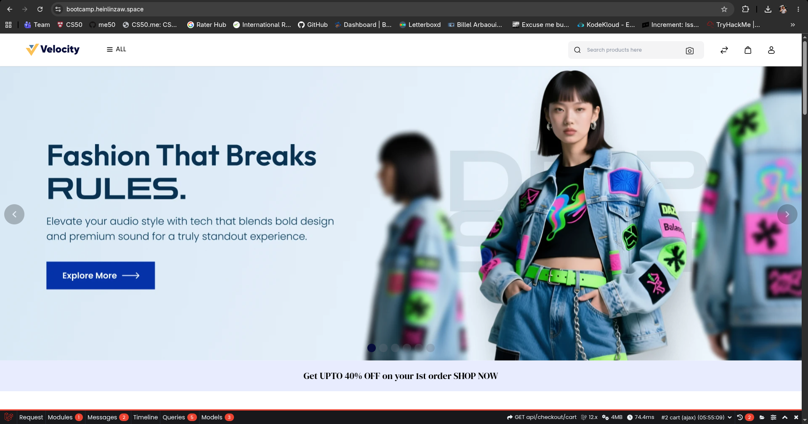

# Terraform Bootcamp: Dynamic E-Commerce Infrastructure

This repository contains a complete Infrastructure as Code (IaC) solution using Terraform to deploy a scalable, production-ready dynamic e-commerce application on AWS. The infrastructure hosts the **Velocity** fashion e-commerce platform with Nginx as the reverse proxy and load balancer.

## End Result

The infrastructure deploys a fully functional e-commerce website using Bagisto as shown below:



The **Velocity** platform is a  dynamic e-commerce site featuring:

- Responsive product catalog and search functionality
- Dynamic inventory management backed by RDS
- Secure HTTPS connections via AWS Application Load Balancer
- High availability and auto-scaling capabilities

## Architecture Overview

This Terraform configuration creates a multi-tier AWS architecture with the following components:

```
┌─────────────────────────────────────────────────┐
│         AWS Region: ap-southeast-1              │
├─────────────────────────────────────────────────┤
│  ┌──────────────────────────────────────────┐   │
│  │    Internet Gateway & NAT Gateway        │   │
│  └──────────────────────────────────────────┘   │
│           ↓                          ↓            │
│  ┌────────────────────┐  ┌────────────────────┐ │
│  │ Public Subnet 1    │  │ Public Subnet 2    │ │
│  │ (AZ ap-southeast-1a)│  │ (AZ ap-southeast-1b)│ │
│  └────────────────────┘  └────────────────────┘ │
│           ↓                          ↓            │
│  ┌────────────────────────────────────────────┐ │
│  │  Application Load Balancer (ALB)           │ │
│  │  - TLS/SSL Termination                     │ │
│  │  - Health Checks                           │ │
│  └────────────────────────────────────────────┘ │
│           ↓                                       │
│  ┌────────────────────┐                         │
│  │ EC2 Instance       │                         │
│  │ - Nginx Web Server │                         │
│  │ - App Server       │                         │
│  └────────────────────┘                         │
│           ↓                                       │
│  ┌─────────────────────────────────────────────┐│
│  │    Private Subnets (RDS Multi-AZ)           ││
│  │  ┌────────────────┐  ┌────────────────────┐││
│  │  │  RDS Primary   │  │  RDS Standby       │││
│  │  │  (ap-southeast-│  │  (ap-southeast-1b) │││
│  │  │  1a)           │  │                    │││
│  │  └────────────────┘  └────────────────────┘││
│  └─────────────────────────────────────────────┘│
└─────────────────────────────────────────────────┘
```

## Key Infrastructure Components

### 1. **VPC Module** (`modules/vpc`)

- Custom VPC with configurable CIDR blocks
- 2 Public subnets (for ALB and EC2)
- 2 Private subnets (for RDS and secure resources)
- Internet Gateway and NAT Gateway for internet connectivity
- Route tables for inbound/outbound traffic management

### 2. **EC2 Module** (`modules/ec2`)

- Auto-scaling EC2 instances in public subnets
- Nginx configured as reverse proxy and web server
- Custom AMI with pre-installed application stack
- IAM instance profile for secure AWS service access
- Security groups controlling inbound/outbound traffic

### 3. **Application Load Balancer Module** (`modules/loadbalancer`)

- Distributes traffic across EC2 instances
- TLS/SSL certificate integration (ACM)
- Health checks for high availability
- Automatic instance registration/deregistration
- DNS configuration via Route 53

### 4. **RDS Module** (`modules/rds`)

- Multi-AZ RDS database for high availability
- Automated backups and point-in-time recovery
- DB subnet group for private subnet placement
- Enhanced monitoring and performance insights
- Database credentials managed via AWS Secrets Manager

### 5. **IAM Module** (`modules/iam`)

- EC2 instance role with minimal permissions
- S3 access for application artifacts
- CloudWatch Logs access for monitoring
- RDS database access from EC2

## Prerequisites

Before deploying this infrastructure, ensure you have:

- **AWS Account** with appropriate permissions
- **Terraform** version >= 1.10.0
- **AWS CLI** configured with credentials
- **Git** for version control

### Install Terraform

```bash
# macOS with Homebrew
brew install terraform

# Linux (Ubuntu/Debian)
sudo apt-get install terraform

# Verify installation
terraform version
```

## Getting Started

### 1. Clone the Repository

```bash
git clone https://github.com/your-org/terraform-bootcamp.git
cd terraform-bootcamp
```

### 2. Configure Variables

Edit `terraform.auto.tfvars.example` with your specific values:

### 3. Initialize Terraform

```bash
terraform init
```

This will:

- Download required providers (AWS)
- Initialize the S3 backend for state management
- Create a local `.terraform` directory

### 4. Plan the Deployment

```bash
terraform plan -out=tfplan
```

Review the planned changes to understand what will be created, modified, or destroyed.

### 5. Apply the Configuration

```bash
terraform apply tfplan
```

This will provision all AWS resources according to your configuration. The process typically takes 10-15 minutes.

## Outputs

After successful deployment, Terraform outputs important resource identifiers:

```bash
terraform output
```

Key outputs include:

- **ALB DNS Name**: URL to access the Velocity platform
- **RDS Endpoint**: Database connection string
- **VPC ID**: VPC identifier for reference
- **EC2 Instance ID**: Running instance identifier

## Project Structure

```
.
├── main.tf                 # Root module with all module calls
├── variables.tf            # Input variables definition
├── outputs.tf              # Output values definition
├── providers.tf            # Terraform and AWS provider configuration
├── terraform.auto.tfvars   # Variable values (update with your config)
├── README.md               # This file
│
└── modules/
    ├── vpc/
    │   ├── main.tf         # VPC, subnets, gateways
    │   ├── variables.tf
    │   └── outputs.tf
    │
    ├── ec2/
    │   ├── main.tf         # EC2 instances, security groups
    │   ├── variables.tf
    │   └── outputs.tf
    │
    ├── loadbalancer/
    │   ├── main.tf         # ALB, target groups, listeners
    │   ├── variables.tf
    │   └── outputs.tf
    │
    ├── rds/
    │   ├── main.tf         # RDS instance, subnet group
    │   ├── variables.tf
    │   └── outputs.tf
    │
    └── iam/
        ├── main.tf         # IAM roles, policies, profiles
        ├── variables.tf
        └── outputs.tf
```

## Managing the Infrastructure

### Viewing Infrastructure State

```bash
# List all resources
terraform state list

# Show specific resource details
terraform state show module.vpc.aws_vpc.main
```

### Updating Configuration

To modify infrastructure:

1. Update the relevant Terraform files
2. Run `terraform plan` to preview changes
3. Run `terraform apply` to apply changes

### SSM Access

This deployment uses AWS Systems Manager Session Manager for instance access instead of SSH. Ensure the EC2 instance role includes the `AmazonSSMManagedInstanceCore` policy and that the SSM agent is installed on the AMI.

Use the following command to start a session:

```bash
aws ssm start-session --target <instance-id>
```

Or you can login to the AWS Console and connect via Session Manager from the EC2 instance details page.

### Scaling EC2 Instances

Edit the `instance_type` variable in `terraform.auto.tfvars`:

```hcl
instance_type = "t3.large"  # or other instance types
```

Then:

```bash
terraform plan
terraform apply
```

### Destroying Infrastructure

To remove all AWS resources:

```bash
terraform destroy
```

**Warning**: This will delete all resources including databases. Ensure you have backups if needed.

## Security Considerations

- **State File**: Stored in S3 with encryption enabled
- **Network Security**: Private subnets isolate database from internet
- **IAM Least Privilege**: EC2 instances have minimal required permissions
- **TLS/SSL**: ALB enforces HTTPS for all traffic
- **VPC Flow Logs**: Monitor network traffic and troubleshoot connectivity

## Monitoring and Logs

### CloudWatch Metrics

- EC2 instance CPU, network, disk metrics
- ALB request count and latency
- RDS database performance metrics

### Application Logs

- Nginx access and error logs
- Application logs stored in `/var/log/app/`

View logs:

```bash
# Start an SSM session into the EC2 instance
aws ssm start-session --target <instance-id>

# View Nginx logs
sudo tail -f /var/log/nginx/access.log
```

## Troubleshooting

### ALB Health Checks Failing

1. Connect to the EC2 instance using AWS Systems Manager Session Manager
2. Verify Nginx is running: `sudo systemctl status nginx`
3. Check security groups allow health check port
4. Review application logs for errors

### Database Connection Issues

1. Verify RDS security group allows EC2 access
2. Check RDS endpoint in Secrets Manager
3. Test connectivity from EC2: `mysql -h <rds-endpoint> -u admin -p`

### Terraform State Lock

If Terraform is locked:

```bash
# Force unlock (use with caution)
terraform force-unlock <lock-id>
```

